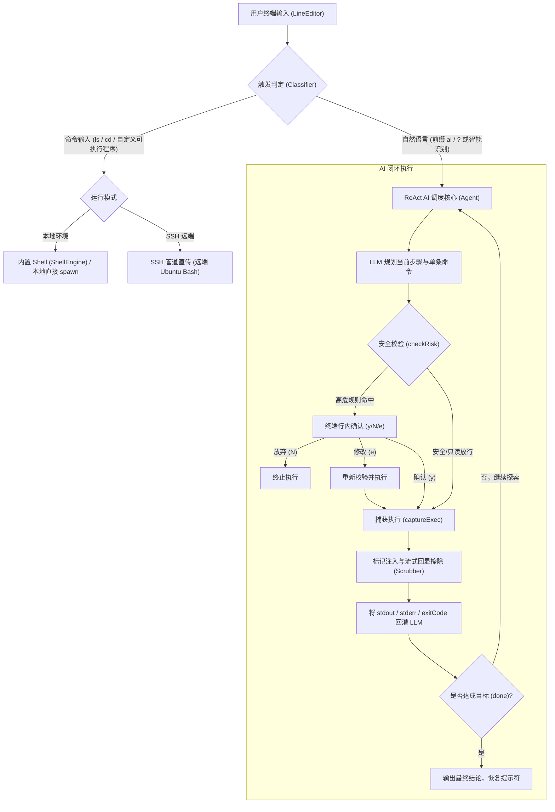

# MonoShell (ai / mono) — 自带 Shell 的单窗口 AI 运维终端

[](https://nodejs.org/)
[](https://www.typescriptlang.org/)
[](LICENSE)
[]()

> **单窗口 AI 终端：直接敲命令，也直接说人话。高危命令强制二次确认。**  
> 没有左右分栏，没有聊天气泡，没有笨重的 Electron 壳——始终保持原生终端的纯粹与高效。

---

## 目录

- [为什么选择 ssh-ai？](#为什么选择-ssh-ai)
- [交互流演示](#交互流演示)
- [核心特性](#核心特性)
- [系统架构与原理](#系统架构与原理)
- [安装与运行](#安装与运行)
- [配置说明](#配置说明)
  - [配置文件位置](#配置文件位置)
  - [完整配置示例](#完整配置示例)
  - [主流大模型接入指南](#主流大模型接入指南)
- [使用手册](#使用手册)
  - [CLI 命令速查](#cli-命令速查)
  - [本地 Shell 与快捷键](#本地-shell-与快捷键)
  - [SSH 远程主机管理](#ssh-远程主机管理)
  - [AI 触发与 ReAct 闭环](#ai-触发与-react-闭环)
  - [高危命令二次确认机制](#高危命令二次确认机制)
- [实战运维场景](#实战运维场景)
- [内置命令支持列表](#内置命令支持列表)
- [项目目录结构](#项目目录结构)
- [已知限制与设计权衡](#已知限制与设计权衡)
- [本地开发与测试](#本地开发与测试)

---

## 为什么选择 ssh-ai？

在日常开发与服务器运维中，传统 AI 工具往往面临如下痛点：

1. **界面割裂**：多数 AI 运维工具基于 Electron 或 Web 页面（如左右分栏、聊天抽屉、对话气泡），破坏了命令行终端的沉浸感与原有工作习惯；
2. **跨平台环境怪癖**：在 Windows 平台下，通过脚本驱动 PowerShell 极其容易被 `PSReadLine` 语法高亮回显污染、换行续行卡死（`>>` 模式）、退出码丢失；
3. **安全隐患**：许多 AI 命令行工具直接代为执行大模型生成的脚本，一旦模型产生幻觉给出 `rm -rf /`、强制覆盖或误停核心服务，后果灾难；
4. **SSH 繁琐**：每次操作远程服务器需要反复配置连接参数、输入密码，缺少与终端深度融合的主机管理能力。

**`ssh-ai` 针对上述问题给出了彻底的解法：**
- **自研内置 Shell**：不依赖系统的 cmd / powershell / bash，在 Windows 上也能开箱使用标准的 `ls`、`cat`、`grep`、`find`、`du` 等 30+ 核心命令，统一各平台运维操作；
- **真正的单窗口沉浸体验**：AI 思考以终端淡色注释行呈现，执行的命令以 `$ <cmd>` 像手工敲击一样就地留痕；
- **规则 + 模型双层安全门禁**：高危正则黑名单与只读白名单组合把关，行内提供 `y`（执行）、`N`（取消）、`e`（现场编辑后执行）交互，随时支持 `Ctrl+C` 熔断；
- **专为 Linux 打造的 SSH 库**：内置主机别名系统，私钥认证优先，远端自动适配与输入回显去重。

---

## 交互流演示

```text
~\Documents\2026\ssh-ai $ ls | head -5
dist/  node_modules/  package-lock.json  package.json  src/
# ↑ 1. 用户手工敲命令：内置 shell 执行，完全不走网络，零延迟、零误判

~\Documents\2026\ssh-ai $ ai 看看哪个目录最占空间
· 统计一级目录占用
$ du -h --max-depth=1 | sort -hr | head -n 20
1.2G    node_modules
14.2M   dist
1.1M    src
# ↑ 2. 说人话：AI 给出简明思考注释（· 统计一级目录占用），生成命令并在终端留痕执行

~\Documents\2026\ssh-ai $ ai 把刚才构建的旧日志全清了
· 查找并清理旧日志文件

危险命令确认 (命中高危规则)
  rm -rf ./dist/*.log
  执行? y 是   N 否(默认)   e 改成别的   e
修改为: rm -i ./dist/*.log
$ rm -i ./dist/*.log
# ↑ 3. 拦截高危操作：命中规则即行内拦截，支持原地二次编辑后放行
```

---

## 核心特性

| 模块 | 核心能力 | 解决的问题 |
|---|---|---|
| **自研行编辑器 (`LineEditor`)** | 纯手写终端输入处理，支持历史记录 `↑`/`↓`、`Tab` 补全、光标移动及 Emacs 快捷键（`Ctrl+A/E/U/K/W/L`） | 摆脱宿主 shell 的 readline 限制，杜绝 PowerShell ANSI 回显污染 |
| **跨平台内置 Shell (`ShellEngine`)** | 内置 30+ 常见 Linux 运维命令（`ls`, `cat`, `grep`, `find`, `du`, `df` 等），支持管道 `\|`、重定向 `>` / `>>` / `<`、多语句 `&&` / `;`、Glob 通配符展开 | 在 Windows 上无缝使用 Linux 操作习惯，外部程序直接调用，不经系统 cmd 解释 |
| **Linux SSH 连接库 (`session/ssh`)** | 交互式别名管理（`add`/`ls`/`rm`/`use`），支持私钥及口令认证，支持登录后自动执行 `startup` 脚本 | 免去频繁输入 IP 与凭据的烦恼，登录后自动配置 `stty -echo` 避免双重回显 |
| **ReAct AI 执行闭环 (`core/agent`)** | 接收自然语言目标 -> 规划单步命令 -> 安全检查 -> 执行并捕获标准输出与退出码 -> 回灌大模型决策 | 实现多步运维自主排查，AI 具备输出感知能力，支持最大步数限制与单步超时保护 |
| **双重安全防护 (`core/safety`)** | ① 规则层正则白名单免扰 / 高危黑名单拦截；② 模型层意图风险标注；终端行内就地确认与改写 | 彻底防止 AI 幻觉引发的破坏性操作（如误删数据、关闭核心守护进程） |
| **流式标记擦除器 (`term/capture`)** | 生成唯一隔离标记（`__AIX_xxxx__`）精准截获子进程命令输出与退出码，内置流式 Scrubber 剔除多余标记 | 让 AI 发起的命令对用户呈现纯净的执行回显，终端不留乱码与隐藏字符 |

---

## 系统架构与原理



### 关键技术实现要点

1. **为什么在 Windows 上自研 Shell 而不用 PowerShell？**  
   - PowerShell 的 `PSReadLine` 会在输入与回显中主动注入复杂的 ANSI 转义序列，流式解析时极易破损；
   - 远程执行注入脚本时，PowerShell 将 `\n` 视为多行续行符（触发 `>>` 悬挂等待），Windows 下必须严格发送 `\r`；
   - `$LASTEXITCODE` 仅对外部原生进程有效，PowerShell 内置 cmdlet 执行失败时为 `$null`，导致退出状态失真。本项目自研 Shell 彻底抹平了底层操作系统的差异。
2. **命令输出精准捕获与擦除机制**：  
   AI 执行命令时，程序会自动组装包裹标记（如 `; echo "__AIX_xxx__:$?"`）。输出流经过专门实现的 `Scrubber` 状态机，根据特征正则剔除回显残留行和标记行，同时在流结束时 flush 缓冲区，确保最终显示既干净又完整。

---

## 安装与运行

### 环境准备
- [Node.js](https://nodejs.org/) `>= 18.0.0`
- `npm` 或 `pnpm`

### 安装步骤

```bash
# 1. 克隆代码库
git clone <repository-url>
cd ssh-ai

# 2. 安装项目依赖
npm install

# 3. 编译 TypeScript 代码
npm run build

# 4. 建立全局命令软链（推荐）
npm link
```

全局链接完成后，即可在任何终端目录下直接执行 `ai`。

### 免安装直接运行（开发调试）

```bash
npx tsx src/index.ts
```

---

## 配置说明

### 配置文件位置

运行 `ai` 或执行 `ai ssh init` 时，会在当前用户根目录下自动创建配置文件：
- **路径**：`~/.ai-shell/config.json`
- **安全属性**：自动尝试设置文件权限为 `600`（仅当前用户可读写），避免凭据泄露。

### 完整配置示例

```jsonc
{
  "llm": {
    "name": "openai",
    "apiKey": "sk-your-api-key-here",
    "baseURL": "https://api.openai.com/v1",
    // 分类使用小模型（追求速度，默认 gpt-4o-mini）
    "classifyModel": "gpt-4o-mini",
    // 决策与命令生成使用大模型（追求准确度，默认 gpt-4o）
    "chatModel": "gpt-4o"
  },
  "shell": {
    "program": "", // 留空将自动探测：Windows 优先 pwsh/powershell/cmd，Unix 默认 /bin/bash
    "args": [],
    "env": {}
  },
  "ssh": {
    "hosts": [] // 保存的主机配置列表，推荐使用 ai ssh add 交互式写入
  },
  "trigger": {
    // 触发模式: "prefix" (默认) | "smart" | "hybrid"
    "mode": "prefix",
    // 触发前缀列表，大小写不敏感
    "prefixes": ["ai ", "ai:", "?", "？"],
    // 当手敲命令报错未找到 (command not found) 时，是否自动由 AI 接管处理
    "fallbackOnNotFound": true
  },
  "safety": {
    // 危险命令正则表达式拦截库
    "dangerous": [
      "\\brm\\s+(-[a-zA-Z]*f[a-zA-Z]*|-rf)\\b",
      "\\bmkfs\\b",
      "\\bdd\\s+if=",
      "\\bshutdown\\b",
      "\\breboot\\b",
      "\\bgit\\s+push\\s+.*(-f|--force)\\b",
      "\\bsystemctl\\s+(stop|disable|restart)\\b"
    ],
    // 只读白名单正则（直接放行）
    "allowlist": [
      "^\\s*(ls|ll|la|pwd|cd|cat|head|tail|less|more|echo|which|whoami|date|uname|hostname)\\b",
      "^\\s*(df|du|free|uptime|top|htop|ps|netstat|ss|ip|ifconfig|ping|curl|wget)\\b",
      "^\\s*(git\\s+(status|log|diff|branch|show|remote)\\b)"
    ],
    // 智能分类判定超时时间（毫秒）
    "classifyTimeoutMs": 800,
    // 防抖预取判定延时（毫秒）
    "prefetchDebounceMs": 400,
    // 单次 AI 运维调优最大迭代轮数
    "maxRounds": 5
  },
  "ui": {
    // AI 思考注释前缀符号
    "notePrefix": "· ",
    // 命令模拟打字回显延迟（毫秒）
    "typeSpeedMs": 18
  }
}
```

### 主流大模型接入指南

`ssh-ai` 采用标准 OpenAI 兼容 SDK，可灵活切换各家模型服务商：

#### 1. DeepSeek
```json
"llm": {
  "name": "deepseek",
  "apiKey": "sk-xxxxxx",
  "baseURL": "https://api.deepseek.com/v1",
  "classifyModel": "deepseek-chat",
  "chatModel": "deepseek-chat"
}
```

#### 2. 阿里云通义千问 (Qwen)
```json
"llm": {
  "name": "qwen",
  "apiKey": "sk-xxxxxx",
  "baseURL": "https://dashscope.aliyuncs.com/compatible-mode/v1",
  "classifyModel": "qwen-turbo",
  "chatModel": "qwen-plus"
}
```

#### 3. 本地 Ollama
```json
"llm": {
  "name": "ollama",
  "apiKey": "ollama",
  "baseURL": "http://localhost:11434/v1",
  "classifyModel": "qwen2.5:7b",
  "chatModel": "qwen2.5:14b"
}
```

---

## 使用手册

### CLI 命令速查

```bash
ai                     # 启动本地内置 shell 交互式终端
ai --ssh <别名>        # 直接连接已保存的 Ubuntu 远程主机
ai ssh ls              # 列出已保存的所有远程连接
ai ssh add             # 交互式添加主机连接配置
ai ssh rm <别名>       # 删除指定主机连接
ai ssh use <别名>      # 连接已保存的主机
ai ssh init            # 快速初始化生成默认配置文件
ai ssh path            # 输出配置文件的本地绝对路径
ai -h, --help          # 查看帮助说明
```

### 本地 Shell 与快捷键

进入 `ai` 后，终端将呈现 Linux 风格统一提示符（如 `~/projects $ `）。

#### 行编辑常用快捷键

| 快捷键 | 功能说明 |
|---|---|
| `Tab` | 自动补全命令名（内置命令 + 系统 PATH）或本地文件路径 |
| `↑` / `↓` | 在历史命令记录中前翻 / 后翻 |
| `Ctrl + A` / `Home` | 光标快速跳至行首 |
| `Ctrl + E` / `End` | 光标快速跳至行尾 |
| `Ctrl + U` | 清除光标前至行首的全部字符 |
| `Ctrl + K` | 剪切/清除光标后至行尾的全部字符 |
| `Ctrl + W` | 向前删除一个词 |
| `Ctrl + L` | 清空当前屏幕输出（保留当前行输入） |
| `Ctrl + C` | 取消当前行输入 / 中断正在运行的任务 |
| `Ctrl + D` | 输入为空时退出当前终端（等同于输入 `exit`） |

### SSH 远程主机管理

针对 Ubuntu / Linux 生产服务器运维设计，交互式管理连接库：

```bash
$ ai ssh add
别名 (如 prod-web-01): staging-node
主机 IP / 域名: 192.168.1.100
端口 [22]: 22
用户名: ubuntu
认证方式: [1] 私钥 (推荐)  [2] 密码  : 1
私钥路径 [C:\Users\username\.ssh\id_rsa]: ~/.ssh/id_rsa
私钥口令 (没有则直接回车): 
登录后自动执行的命令 (可选，多条用 ; 分隔): cd /data/logs; sudo su -
备注 (可选): 测试集群网关节点
已保存：staging-node -> ubuntu@192.168.1.100
```

- **连接**：`ai --ssh staging-node` 即可直连。
- **回显优化**：连接建立后，后台自动执行 `stty -echo`，彻底交由本地 `LineEditor` 统一渲染，消除网络延迟抖动导致的按键卡顿与重复字符。

### AI 触发与 ReAct 闭环

支持三种触发判定模式（在 `trigger.mode` 中配置）：

1. **`prefix`（默认推荐）**：
   - 必须以 `ai `、`ai:`、`?` 或 `？` 开头才会调动模型。
   - 其余输入 100% 当作 Shell 命令本地立即执行，保证**零延迟、零网络请求、零误判**。
2. **`smart`（智能模式）**：
   - 本地启发式规则快判（中文字符特征、命令词字典、PATH 缓存）；
   - 用户敲键盘停顿间隙进行**投机预取（Prefetch）**，回车时优先命中判定缓存；
   - 拿不准时调用轻量 LLM 进行判定。
3. **`hybrid`（混合模式）**：
   - 显式前缀必定触发，非前缀行若被判定为提问意图亦可触发。
4. **`fallbackOnNotFound`（报错自动兜底）**：
   - 当用户不带前缀误把自然语言当命令直接回车（如输入 `查一下昨天的大日志`），系统收到 `command not found` 或类似系统报错后，会自动提示 `这句不像命令，交给 AI 试试` 并无缝接管执行。

### 高危命令二次确认机制

AI 执行操作时具备严格防线：

```text
危险命令确认 (命中高危规则)
  systemctl stop nginx
  执行? y 是   N 否(默认)   e 改成别的   
```

- 按 `y` / `Y`：放行并执行；
- 按 `n` / `N` / `Enter`：取消并终止当前 AI 流程；
- 按 `e` / `E`：进入**就地编辑模式**，允许将命令改为 `systemctl restart nginx` 后再安全执行；
- 随时按 `Ctrl+C` 立即强制熔断退出。

---

## 实战运维场景

### 场景 1：排查磁盘膨胀原因
```bash
$ ai 看看磁盘空间，找出一级目录里最大的 5 个
· 检查磁盘整体用量并列出大目录
$ df -h
Filesystem      Size  Used Avail Use% Mounted on
/dev/vda1        40G   36G  1.8G  96% /
· 统计一级子目录空间排序
$ du -h --max-depth=1 / | sort -hr | head -n 6
36G     /
24G     /var
8.2G    /data
2.1G    /usr
1.1G    /home
· /var 目录占用过高，主要分布在日志与容器缓存
```

### 场景 2：检索分析异常日志
```bash
$ ai 统计当前目录下最近 1000 条日志里的 500 错误状态码数量
· 检索并统计 access.log 中的 500 状态码
$ tail -n 1000 access.log | grep -c "HTTP/1.1\" 500"
42
· 发现 42 条 500 错误日志
```

### 场景 3：端口与服务排查
```bash
$ ai 8080 端口被谁占了？把它的进程详情找出来
· 查询占用 8080 端口的进程
$ netstat -tlpn | grep :8080
tcp        0      0 0.0.0.0:8080            0.0.0.0:*               LISTEN      14285/node
· 查看进程 14285 详细信息
$ ps -fp 14285
UID          PID    PPID  C STIME TTY          TIME CMD
www-data   14285    1200  0 10:20 ?        00:00:15 /usr/bin/node /app/server.js
· 端口 8080 由 PID 为 14285 的 node 服务占用
```

---

## 内置命令支持列表

内置 Shell 在 Windows / Linux / macOS 下提供一致的类 Unix 行为，支持以下内置指令及常见参数：

| 命令 | 支持的主要选项与行为 |
|---|---|
| `ls` | `-l` 详细长列表模式（显示权限、大小、修改时间），`-a` 显示隐藏文件 |
| `cd` | 目录切换，支持 `~` 用户主目录展开，支持绝对与相对路径 |
| `pwd` | 输出当前工作绝对路径 |
| `cat` | 支持读取多个文件拼接输出，无参数时读取标准输入 `stdin` |
| `head` | `-n <行数>` 输出前 N 行（默认 10 行），支持管道与文件输入 |
| `tail` | `-n <行数>` 输出尾部 N 行（默认 10 行），支持管道与文件输入 |
| `wc` | `-l` 行数统计，输出行数、词数、字节数 |
| `grep` | `-i` 忽略大小写，`-n` 显示行号，`-v` 反向匹配，支持正则表达式 |
| `find` | `-name <通配符>` 名称匹配，`-type [f\|d]` 文件/目录类型筛选，`-maxdepth <深度>` 限制检索层级 |
| `du` | `-s` 汇总统计，`-h` 人类可读体积显示（K/M/G），`--max-depth=<N>` 统计层级深度 |
| `df` | 磁盘分区占用与剩余空间容量统计 |
| `stat` | 打印文件/目录大小、访问权限掩码、最后修改时间等元数据 |
| `mkdir` | `-p` 递归级联创建多级目录 |
| `rmdir` | 删除指定空目录 |
| `touch` | 创建新空文件或刷新已有文件修改时间 |
| `rm` | `-r` 递归删除目录，`-f` 强制删除不存在的文件时不报错 |
| `cp` | 文件拷贝复制 |
| `mv` | 文件/目录重命名或移动 |
| `echo` | 终端字符输出，支持管道与引号去义 |
| `env` / `export` / `unset` | 环境变量查看、注入设置与移除销毁 |
| `which` | 检索指定可执行命令所在的系统绝对物理路径 |
| `whoami` | 输出当前运行身份用户名 |
| `date` | 输出当前标准系统时间 |
| `uname` | `-a` 输出底层操作系统类型、架构与主机名 |
| `sleep` | 延时休眠（秒） |
| `history` | 查阅当前会话的历史敲击命令索引列表 |
| `alias` / `unalias` | 别名创建与移除 |
| `clear` | 终端全屏清空刷新 |
| `exit` | 退出当前运行会话 |

> **注**：对于未内置的命令（如 `git`, `docker`, `npm`, `curl`, `python` 等），`ShellEngine` 会自动在系统 `PATH` 路径中搜寻并直接以子进程 `spawn` 执行。

---

## 项目目录结构

```text
ssh-ai/
├── src/
│   ├── index.ts          # 程序 CLI 主入口与 REPL 调度循环
│   ├── config.ts         # 配置加载、默认值初始化与安全规则定义
│   ├── cli/
│   │   └── hosts.ts      # SSH 远程主机增删改查交互式管理
│   ├── core/
│   │   ├── agent.ts      # ReAct Agent 调度器与多轮反思机制
│   │   ├── classifier.ts # 自然语言 vs 命令判定器与投机预取
│   │   ├── llm.ts        # OpenAI 兼容客户端适配层
│   │   ├── prompt.ts     # 系统提示词与多步历史块组装
│   │   └── safety.ts     # 规则层危险正则库与白名单校验
│   ├── session/
│   │   ├── types.ts      # 终端会话抽象接口定义
│   │   ├── local.ts      # 本地 PTY 会话封装 (node-pty)
│   │   └── ssh.ts        # SSH2 远程通道与自动配置
│   ├── shell/
│   │   ├── line.ts       # 自研终端行编辑器 (输入回显/光标/Tab补全/快捷键)
│   │   ├── parser.ts     # 轻量 POSIX 语法解析器 (引号/管道/重定向/&&/;)
│   │   └── builtin.ts    # 30+ 跨平台类 Unix 内置命令实现
│   │   └── engine.ts     # 内置 Shell 执行调度引擎
│   └── term/
│       ├── capture.ts    # 命令输出捕获包装器与流式 Scrubber 擦除器
│       └── ui.ts         # 终端行内确认、警示与注释行 UI 渲染
├── test/
│   ├── shell.ts          # 内置 Shell 核心命令与语法冒烟测试集
│   └── smoke.ts          # PTY 进程透传与输出截获端到端测试集
├── package.json
└── tsconfig.json
```

---

## 已知限制与设计权衡

1. **全屏交互式程序支持**：
   - 在**本地内置 Shell** 模式下，目前不支持 `vim`、`nano`、`htop` 等需要复杂 curses / 全屏重绘的交互式程序；
   - 在 **SSH 远程模式** 下，底层为原生 Linux 终端流，可正常使用全部全屏程序。
2. **作业控制 (Job Control)**：
   - 内置 Shell 暂不支持复杂的作业控制操作（如 `Ctrl+Z` 挂起后台、`fg`/`bg` 唤醒）。
3. **变量展开限制**：
   - 暂不支持复杂的 Shell Script 语法（如 `for i in ...; do` 语法块或 `${VAR:-default}` 复杂参数展开），建议复杂脚本直接写入 `.sh` 文件后执行。

---

## 本地开发与测试

```bash
# 编译 TypeScript 产物
npm run build

# 运行内置 Shell 功能测试
cmd /c npx tsx test/shell.ts

# 运行 PTY 冒烟捕获测试
cmd /c npx tsx test/smoke.ts
```

---

## 许可证

本项目基于 [MIT 许可证](LICENSE) 开源。
