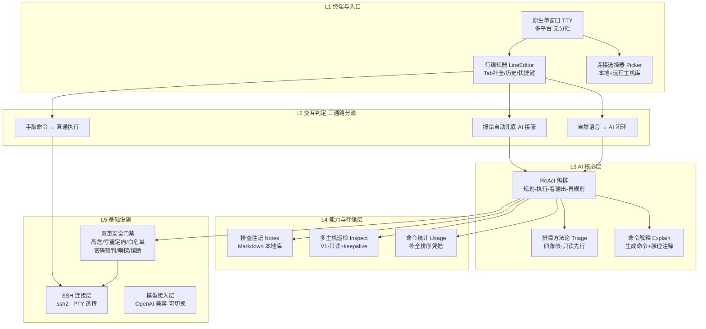

# MonoShell 产品文档

> 版本：v1.1
> 一句话定位：**会记事的 AI 运维终端** —— 记不住命令，AI 代笔；服务器出问题，AI 排查；踩过的坑，自动留痕可查。
> 配套技术设计：见 `docs/technical-design.md`（模块接口、数据结构、测试策略）。

---

## 1. 产品概览

### 1.1 产品定位

MonoShell 是运行在原生终端里的单窗口 AI 运维助手。用户在同一个终端里既能直接敲命令，也能用自然语言让 AI 执行、排查、讲解、留痕。产品不做 Electron / Web / 左右分栏界面，保持终端的沉浸感与原有操作习惯。

### 1.2 核心能力

| 能力 | 解决的问题 | 阶段 |
|---|---|---|
| 命令代笔 | Linux 命令记不住，说人话让 AI 生成命令并讲解原理 | V0 |
| 排障对话 | 服务器出问题不知从哪查起，AI 按方法论自主定位 | V0 |
| 排查注记 | 坑重复踩，每次排查确认后沉淀为可检索的本地知识 | V0 |
| 多主机只读巡检 | 多台机器批量只读体检，快速定位异常机器 | V1 |

### 1.3 目标用户

| 用户 | 核心场景 | 期望价值 |
|---|---|---|
| 后端 / 运维工程师 | 日常 Linux 运维、故障排查 | 说人话拿命令、AI 自主定位、坑不白踩 |
| 全栈 / 前端开发者 | 偶尔碰服务器、对运维生疏 | 不敢乱动但知道发生了什么 |
| 多主机管理者 | 几十台机器批量检查 | 一次巡检多台、快速定位异常 |

### 1.4 产品边界

- 只做交互式运维排查，不做监控大屏、财务分析类功能。
- AI 只建议命令并说明后果，执行权始终在用户。
- 不实现云端同步、团队共享、Web 界面。

---

## 2. 系统架构

### 2.1 架构图



### 2.2 网络与连接策略

SSH 连接使用 `ssh2` 库建立协议与认证，远端以原生 PTY（pseudo-tty）通道方式透传。本地终端负责渲染用户输入；命令与输出原样透传远端，不自行实现终端仿真渲染。由此，tmux / vim / top 等全屏程序由远端 PTY 天然支持。

### 2.3 三条交互通路

| 通路 | 判定依据 | 行为 | 特点 |
|---|---|---|---|
| 手敲命令 | 非 AI 前缀 | 直通执行 | 零延迟 / 零网络请求 / 零误判 |
| 自然语言 | `ai ` / `ai:` / `?` / `？` 开头 | 进入 ReAct 闭环 | AI 规划、执行、反思 |
| 报错兜底 | 命令回显 `command not found` 等 | 提示"这句交给 AI" | 减少误操作挫败 |

守护规则：手敲命令默认 `confirmManual:true`，命中高危才确认；AI 生成的命令**始终**过安全门禁。

---

## 3. 功能点

### 3.1 命令代笔（V0）

目标：用户用自然语言描述目标，AI 生成可直接执行的命令，并附原理注释帮助用户理解和记忆。

| 功能点 | 说明 | 交互示例 |
|---|---|---|
| 自然语言触发 | 以 `ai `/`ai:`/`?`/`？` 开头调用模型 | `ai 找出内存占用最高的5个进程` |
| 命令生成 | AI 返回单条可执行命令与动作说明 | → `ps aux --sort=-%mem \| head -n 6` |
| 原理注释 | 命令下打印 `why`（≤40 字）与 `expect`（预期输出） | `· 原理：ps 列进程，--sort 按内存降序` |
| 可解释开关 | 配置 `agent.explain` 控制 | true=常显注释；false=不生成不渲染 |
| 多轮反思 | 执行结果回灌模型，依据输出继续下一步 | 磁盘满 → df → du → 定位到 /var |

验收标准：对"磁盘满 / 端口占用 / 内存高 / 日志 500"四类问题，AI 输出的命令无需修改即可执行，且每条命令附可理解的原理注释。

### 3.2 排障对话（V0）

目标：AI 按固定方法论排查，避免从空白目标乱试、乱执行破坏性命令。

| 功能点 | 说明 |
|---|---|
| 四象限探查 | 固定顺序：资源 → 服务 → 网络 → 日志 |
| 只读先行 | 优先使用只读命令；写操作前必须明确告警，默认不写 |
| 单象限推进 | 一次只走一个象限，不并行乱试 |
| 确诊再修 | 找到根因后才提议修复，修复命令一律过安全门禁 |
| 进度标注 | 对话历史附当前所处象限，帮助 AI 掌握排查进展 |

验收标准：对给定症状，AI 自主执行 ≥3 步只读命令后给出根因假设；未经用户确认不触发任何写 / 重启操作。

### 3.3 排查注记（V0）

目标：把每次排查沉淀成本机可检索的 Markdown 知识。

| 功能点 | 说明 |
|---|---|
| 草稿生成 | 排查收尾时生成注记草稿，不写盘 |
| 确认保存 | 询问用户，确认后落盘；配置 `agent.noteConfirm:false` 则不记录 |
| 存储结构 | `~/.ai-shell/notes/<主机>/<日期>_<序号>.md` |
| 注记模板 | 症状 / 排查链路 / 根因 / 处置 / 标签 |
| 检索命令 | `ai note ls` / `show` / `search <关键词>` / `rm` |

注记文件模板：

```markdown
# 2026-09-15 磁盘利用率过高 (prod-web-01)
## 症状
磁盘 96%，生产 web-01
## 排查链路
1. df -h → /dev/vda1 96%
2. du -h --max-depth=1 / → /var 24G
3. tail /var/log/... → 旧构建日志残留
## 根因
构建产物未清理，日志累积
## 处置
rm -i ./dist/*.log（已确认）
## 标签
#磁盘 #日志 #清理
```

验收标准：一次完整排查结束后经用户确认能生成符合模板的注记；`ai note search "磁盘"` 能召回；用户取消时不写任何文件。

### 3.4 多主机只读巡检（V1）

目标：对多台已保存主机并发执行只读体检，快速定位异常。

| 功能点 | 说明 |
|---|---|
| 批量巡检 | `ai inspect all` / `ai inspect <别名>` |
| 只读命令集 | `df` / `load` / `ss` / `uptime` 等，只允许只读 |
| 并行控制 | 配置 `inspect.parallel` 控制并发巡检台数 |
| 超时保护 | 单台超时 `inspect.timeoutMs`，单命令超时 `inspect.cmdTimeoutMs` |
| 保活机制 | `inspect.keepaliveMs` 定时发送 TCP keepalive，防长查询断连 |
| 汇总表格 | 多机结果并列展示，高亮异常项（如磁盘 > 90%） |
| 不写盘 | 巡检结果只回显，不落盘、不执行写入 |

验收标准：对 N 台主机并发跑完只读检查，汇总表格中异常机器被高亮；期间无任何写入命令产生。

### 3.5 安全门禁（V0）

| 功能点 | 说明 |
|---|---|
| 双档判定 | AI 命令走 `full` 档；用户手敲命令走 `dangerous` 档 |
| 高危黑名单 | `rm -rf` / `systemctl stop` / `mkfs` / `dd if=` / `git push -f` 等 |
| 写重定向拦截 | AI 命令含 `>` / `>>`（`> /dev/null` 除外）需确认 |
| 只读白名单 | 命中白名单命令直接放行，不打扰 |
| 行内确认 | `y` 执行 / `N` 取消 / `e` 原地修改命令后执行 |
| 密码命令接管 | sudo / su 等命令交回用户终端，AI 不代输密码 |
| 运行时嗅探 | 输出出现密码提示立即中断，不干等超时 |
| Ctrl+C 熔断 | 任意时刻按键即中断当前任务 |

验收标准：高危命令命中即行内确认；`N` / `Ctrl+C` 可熔断；无静默执行。sudo 类命令提示交回终端，用户可手动输密码。

### 3.6 全屏程序支持

| 程序 | 支持方式 |
|---|---|
| tmux / vim / top / less / htop / nano | 远端真实 PTY 原生支持，字节级透传，无需嗅探 |
| 补全 / AI 入口 | 全屏程序运行时自动让位（暂停），退出后恢复 |

---

## 4. 用户交互流程

### 4.1 命令代笔

```text
$ ai 查看当前目录哪个文件夹最占空间
· 统计一级目录占用
$ du -h --max-depth=1 | sort -hr | head -n 20
· 原理：du 统计占用，sort -hr 人类可读降序，head 取前20
· 预期：看到最大目录在顶部
24G    dist
...
```

### 4.2 排障对话

```text
$ ai 服务器 8080 端口被谁占了
→ 资源层
$ ss -tlpn | grep :8080
· 原理：ss 显示监听端口，-t 只看 TCP，-l 监听，-p 显示进程
tcp   LISTEN  14285  node /app/server.js
→ 服务层确认
$ systemctl status myapp
· 预期：看到服务运行正常，端口由 node 进程监听
→ 确诊：8080 由 PID 14285 的 node 服务占用
```

### 4.3 排查注记

```text
$ ai 网络超时 频繁
· 定位到 DNS 解析失败
· 排查结束，是否保存为注记？(y 保存 / N 不保存) y
  已保存：~/.ai-shell/notes/prod-01/2026-09-15_1.md
$ ai note search DNS
  找到 3 条注记：…（快速召回历史解法）
```

### 4.4 多主机巡检（V1）

```text
$ ai inspect all
  prod-web-01  disk 96% ⚠ · load 2.3 · ss 80 连接
  node2        disk 42%   · load 0.5 · ss 12 连接
  db-01        disk 88% ⚠ · load 1.1 · ss 200 连接
```

---

## 5. 配置项

```jsonc
{
  "agent": {
    "maxRounds": 5,        // AI 最多迭代轮数
    "retries": 2,          // 单轮失败重试次数
    "timeoutMs": 50000,    // 单轮模型调用超时
    "explain": true,       // 命令附原理注释
    "triage": true,        // 注入排障方法论
    "noteConfirm": true    // 排查结束确认后存注记
  },
  "notes": {
    "dir": "~/.ai-shell/notes"   // 注记根目录
  },
  "inspect": {             // V1 多主机巡检
    "parallel": 5,
    "timeoutMs": 15000,
    "keepaliveMs": 30000,
    "cmdTimeoutMs": 10000
  }
}
```

---

## 6. 版本规划

| 版本 | 范围 | 交付物 |
|---|---|---|
| V0 | 命令代笔、排障方法论、排查注记 | 三个核心模块 + 内置 shell / 安全门禁增强 + 单元测试 |
| V1 | 多主机只读巡检 | 巡检模块 + keepalive 保活 + 测试 |
| V2 | 视采用度扩展 | 延后 |

---

## 7. 验收总览

| 能力 | 验收条件 |
|---|---|
| 命令代笔 | 四类常见问题可生成可执行命令并附原理注释 |
| 排障 | 可完成 ≥3 步只读定位并给出根因假设；无未确认写入 |
| 注记 | 经确认生成模板注记；可检索召回；取消时不写盘 |
| 巡检（V1） | 多机并行只读 + keepalive 保活 + 汇总高亮异常 |
| 安全 | 高危命令命中即确认；可熔断；sudo 命令交回终端 |

---

## 8. 风险评估

- 安全依赖：只读优先纪律依赖模型提示词约束与规则黑名单双保险，黑名单需持续累积。
- 模型输出：命令与 `why` 注释均来自模型，需对注释做长度与转义清洗，防止注水或终端注入。
- token 成本：多轮排查消耗模型 token，通过 `maxRounds` / `timeoutMs` 控制上限。
- 巡检边界：只允许只读命令，任何写入必须切回单机并经用户确认。
- 注记时效：历史注记仅作参考线索，不代表机器当前状态。